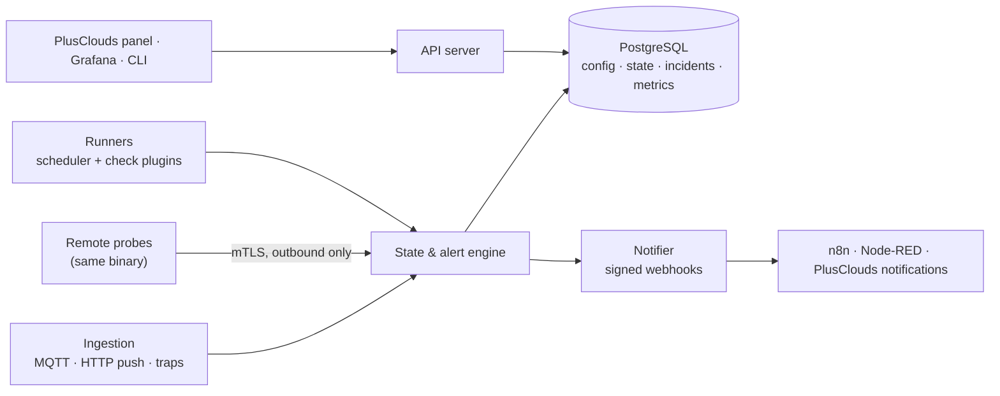

# monitoring.server

An API-first, extensible monitoring engine written in Go. One engine watches network devices, server hardware (BMCs), IP cameras, web endpoints and ports, hypervisors and their VMs, and IoT/facility devices, and turns what it sees into incidents and signed webhook events.

> **Status: planning.** No code has been written yet. This repository currently holds the design, the feature specs and the architecture decisions. Everything below describes the intended system.

Developed by [PlusClouds](https://plusclouds.com) under the MIT license. It runs standalone or embedded in the PlusClouds panel, and it is multi-tenant from day one because customers run it too.

---

## What it does

| Target | How | Examples of what is collected |
| --- | --- | --- |
| Network devices | SNMP v2c/v3, ICMP, SNMP traps | CPU, memory, uptime, per-interface status, bandwidth, errors, discards |
| Server hardware | Redfish (preferred), IPMI, SNMP | Temperatures, fans, PSUs, power draw, disks/RAID, DIMMs, event log |
| IP cameras | ICMP, RTSP, ONVIF, HTTP snapshot | Reachability, codec, resolution, FPS, bitrate, RTP loss/jitter |
| Web and services | HTTP(S), TCP, UDP, DNS, TLS, WHOIS | Status code, keyword match, timing breakdown, certificate and domain expiry |
| Hypervisors and VMs | XenServer/XCP-ng first, then VMware, then Proxmox | Host CPU/memory/NIC/storage, per-VM CPU ready/steal, memory, disk latency, snapshots |
| IoT and facility | MQTT, SNMP (UPS/PDU), HTTP push | UPS battery/runtime, PDU current, temperature/humidity/leak/door sensors, last-seen |

Design target: **10,000+ devices**, check intervals from **5 seconds to several hours**.

## Principles

- **API-first.** Every action is an API call (REST + OpenAPI under `/v1`). Any UI or CLI is a client of that API.
- **Extensible by plugins.** New protocols and device types are plugins or templates, never core changes.
- **Simple to run.** One Go binary with switchable roles; the same binary runs as a remote probe.
- **Quiet by default.** Pending states, hysteresis, flap detection and dependency suppression are built into the core. Noise is a bug.
- **Open-source first.** Standard formats, permissively licensed dependencies, no backend that forces a restrictive license on users.

## Architecture at a glance



- **Storage:** PostgreSQL for everything. Metrics use time-partitioned tables by default, TimescaleDB automatically when present, ClickHouse as a later scale-out backend.
- **Dashboards:** Grafana, reading PostgreSQL directly. There is no built-in UI in this phase.
- **Notifications:** one channel, a signed webhook. Routing to email, Slack or SMS happens downstream.
- **PlusClouds integration:** accounts and users live in the PlusClouds API. The engine keeps only a minimal mirror keyed by PlusClouds UUIDs, stores devices, credentials and webhooks itself, and accepts external IDs on every resource PlusClouds links to ([ADR-0012](docs/adr/0012-plusclouds-identity-and-external-ids.md)). Standalone installs work without PlusClouds.

## Documentation

| Document | What it covers |
| --- | --- |
| [Design document](docs/monitoring%20server%20design.md) | The full system design: targets, architecture, data model, alerting, API, security, roadmap |
| [Feature specs](docs/features/README.md) | One spec per sub-feature, with MVP scope, behavior and acceptance criteria |
| [Architecture decision records](docs/adr/README.md) | Infrastructure and technology decisions, each with options considered and consequences |
| [Standards and compliance](docs/compliance/README.md) | Which certifications apply (and why most certify organizations, not the engine), standards the engine implements, and the ISO/IEC 27001 control mapping |

## Roadmap

| Phase | Focus | Exit gate |
| --- | --- | --- |
| **MVP** | Core loop end to end: checks for every target type at a basic level, state machine, incidents, signed webhooks, tenants and audit, PostgreSQL metrics | Live on our own datacenter |
| **Phase 2** | Scale and noise control: remote probes with failover, dependencies, maintenance, traps/syslog, templates and discovery, VMware and Proxmox, escalation | Stable on remote sites |
| **Phase 3** | Customer-facing: PlusClouds panel integration, SLA reports, status pages, NetFlow, Terraform provider, ClickHouse backend | Offered to customers |

## Planned usage

These commands describe the intended interface and do not work yet.

```sh
# All roles in one process (small installs)
monitor serve --config /etc/monitor/config.yaml

# Split roles for larger installs
monitor serve --roles api,notifier
monitor serve --roles runner,engine

# Remote probe: enrolls once with a token, then connects out over mTLS
monitor probe --core https://monitor.example.com --enroll-token <token>
```

## Contributing

The project is in the design phase. Proposals and reviews happen on the feature specs and ADRs: open a pull request that edits the relevant document, or add a new ADR using the [template](docs/adr/0000-template.md).

## License

[MIT](LICENSE)
