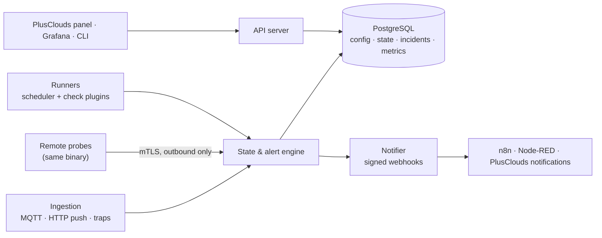

# monitoring.server

An API-first, extensible monitoring engine written in Go. One engine watches network devices, server hardware (BMCs), IP cameras, web endpoints and ports, hypervisors and their VMs, and IoT/facility devices, and turns what it sees into incidents and signed webhook events.

> **Status: milestone M1 (skeleton).** The binary, process config, database schema, tenancy and API keys, audit log, plugin SDK and the `icmp` and `http` plugins exist. Scheduling, state, incidents and notifications (M2) do not yet. The rest of this page describes the intended system; see [Development](#development) for what runs today.

Developed by [PlusClouds](https://plusclouds.com) under the MIT license. It runs standalone or embedded in the PlusClouds panel, and it is multi-tenant from day one because customers run it too.

---

## What it does

| Target | How | Examples of what is collected |
| --- | --- | --- |
| Network devices | SNMP v2c/v3, ICMP, SNMP traps | CPU, memory, uptime, per-interface status, bandwidth, errors, discards |
| Server hardware | Redfish (preferred), IPMI, SNMP | Temperatures, fans, PSUs, power draw, disks/RAID, DIMMs, event log |
| IP cameras | ICMP, RTSP, ONVIF, HTTP snapshot | Reachability, codec, resolution, FPS, bitrate, RTP loss/jitter |
| Web and services | HTTP(S), TCP, UDP, DNS, TLS, WHOIS | Status code, keyword match, timing breakdown, certificate and domain expiry |
| Hypervisors and VMs | XenServer/XCP-ng first, then VMware, then Proxmox | Host CPU/memory/NIC/storage, per-VM CPU ready/steal, memory, disk latency, snapshots |
| IoT and facility | MQTT, SNMP (UPS/PDU), HTTP push | UPS battery/runtime, PDU current, temperature/humidity/leak/door sensors, last-seen |
| LLMs | Synthetic inference requests, Prometheus scraping, OpenTelemetry GenAI traces | Availability, time to first token, tokens/s, GPU health; per application errors, tokens, cost and quality scores |

Design target: **10,000+ devices**, check intervals from **5 seconds to several hours**.

## Principles

- **API-first.** Every action is an API call (REST + OpenAPI under `/v1`). Any UI or CLI is a client of that API.
- **Extensible by plugins.** New protocols and device types are plugins or templates, never core changes.
- **Simple to run.** One Go binary with switchable roles; the same binary runs as a remote probe.
- **Quiet by default.** Pending states, hysteresis, flap detection and dependency suppression are built into the core. Noise is a bug.
- **Open-source first.** Standard formats, permissively licensed dependencies, no backend that forces a restrictive license on users.

## Architecture at a glance



- **Storage:** PostgreSQL for everything. Metrics use time-partitioned tables by default, TimescaleDB automatically when present, ClickHouse as a later scale-out backend.
- **Dashboards:** Grafana, reading PostgreSQL directly. There is no built-in UI in this phase.
- **Notifications:** one channel, a signed webhook. Routing to email, Slack or SMS happens downstream.
- **PlusClouds integration:** accounts and users live in the PlusClouds API. The engine keeps only a minimal mirror keyed by PlusClouds UUIDs, stores devices, credentials and webhooks itself, and accepts external IDs on every resource PlusClouds links to ([ADR-0012](docs/adr/0012-plusclouds-identity-and-external-ids.md)). Standalone installs work without PlusClouds.

## Documentation

| Document | What it covers |
| --- | --- |
| [Design document](docs/monitoring%20server%20design.md) | The full system design: targets, architecture, data model, alerting, API, security, roadmap |
| [Feature specs](docs/features/README.md) | One spec per sub-feature, with MVP scope, behavior and acceptance criteria |
| [Architecture decision records](docs/adr/README.md) | Infrastructure and technology decisions, each with options considered and consequences |
| [Implementation progress](docs/progress.md) | Milestone status, what is done, and what comes next |
| [Standards and compliance](docs/compliance/README.md) | Which certifications apply (and why most certify organizations, not the engine), standards the engine implements, and the ISO/IEC 27001 control mapping |

## Roadmap

| Phase | Focus | Exit gate |
| --- | --- | --- |
| **MVP** | Core loop end to end: checks for every target type at a basic level, state machine, incidents, signed webhooks, tenants and audit, PostgreSQL metrics | Live on our own datacenter |
| **Phase 2** | Scale and noise control: remote probes with failover, dependencies, maintenance, traps/syslog, templates and discovery, VMware and Proxmox, escalation, LLM endpoints and trace metrics | Stable on remote sites |
| **Phase 3** | Customer-facing: PlusClouds panel integration, SLA reports, status pages, NetFlow, Terraform provider, ClickHouse backend, LLM quality evaluation | Offered to customers |

## Deployment with Docker Compose

[deploy/compose](deploy/compose) runs the published image with its own PostgreSQL. The database is not exposed, passwords and the key-encryption key come from `.env`, and the first start bootstraps the installation by itself.

```sh
cd deploy/compose
cp .env.example .env          # fill in the passwords (openssl rand -hex 24) and MONITOR_KEK (openssl rand -base64 32)
docker compose up -d
docker compose logs bootstrap # the platform key, printed on the first start only
```

Every later `up` applies new migrations and leaves the installation as it is. The API listens on `127.0.0.1:8443` by default; put a TLS-terminating proxy in front before exposing it. Back up the PostgreSQL volume and `MONITOR_KEK`: without the key, stored device credentials cannot be decrypted.

## Development

Requirements: Docker. Go 1.27 only to build and test from source.

**Run in Docker** (PostgreSQL 18 and the engine; migrations run on start):

```sh
docker compose -f deploy/docker-compose.yml up -d --build --wait
docker compose -f deploy/docker-compose.yml run --rm monitor admin bootstrap   # prints the platform key once

curl http://127.0.0.1:8443/healthz
curl -H "Authorization: Bearer <key>" http://127.0.0.1:8443/v1/tenants
open http://127.0.0.1:8443/docs
```

The container uses [deploy/docker/config.yaml](deploy/docker/config.yaml) (development only: inline passwords, plain HTTP). Its health check runs `monitor health` against the status server on loopback. `docker compose … down -v` removes the database.

**Run from source** against the same database. The database is on a private network by default; the override file publishes it on `127.0.0.1:55432` for the host:

```sh
docker compose -f deploy/docker-compose.yml -f deploy/docker-compose.db-port.yml up -d --wait postgres
make build
./bin/monitor migrate up --config deploy/dev/config.yaml
./bin/monitor admin bootstrap --config deploy/dev/config.yaml --standalone --tenant "Dev"   # prints an admin key once
./bin/monitor serve --config deploy/dev/config.yaml

curl -H "Authorization: Bearer <key>" http://127.0.0.1:8443/v1/me
curl http://127.0.0.1:9090/readyz
```

Without `--standalone`, bootstrap prints the platform key that the PlusClouds API uses to provision tenants (`PUT /v1/tenants/by-external-id/{id}`) and act for users.

| Command | Purpose |
| --- | --- |
| `monitor serve [--roles api,…]` | Run the engine roles (only `api` is implemented so far) plus the status server |
| `monitor migrate up\|down\|status` | Database migrations, as the schema owner |
| `monitor admin bootstrap [--standalone --tenant NAME]` | Create the installation ID, the platform tenant and the first key (once) |
| `monitor admin verify-audit [--tenant ID]` | Check the audit log hash chain |
| `monitor admin gen-token` | Random token for status and preshared enrollment tokens |
| `monitor config validate\|print [--probe]` | Check a config file, or print the effective config with secrets redacted |
| `monitor health [--url …]` | Exit 0 when the readiness endpoint answers 200 (container health checks) |

| Make target | What it runs |
| --- | --- |
| `make test` | Unit and integration tests with `-race` (integration tests start PostgreSQL with testcontainers) |
| `make lint` | golangci-lint, including gosec |
| `make generate` | Regenerates the API server from `api/openapi.yaml` |
| `make check` | Everything CI runs: tidy, generated code, lint, tests, govulncheck, license allowlist |
| `scripts/ci.sh lint\|test\|security` | The CI steps exactly as the runner runs them, inside the Go toolchain image (needs only Docker) |

Configuration reference: [deploy/config.example.yaml](deploy/config.example.yaml) and [deploy/probe.example.yaml](deploy/probe.example.yaml). API reference: [api/openapi.yaml](api/openapi.yaml), rendered at `/docs` on a running server.

**Postman:** import [api/postman/monitoring.postman_collection.json](api/postman/monitoring.postman_collection.json) and [api/postman/local.postman_environment.json](api/postman/local.postman_environment.json), put the platform key from `monitor admin bootstrap` in `platformKey`, and run the folders in order. From the command line:

```sh
npx newman run api/postman/monitoring.postman_collection.json \
  -e api/postman/local.postman_environment.json --env-var platformKey=mon_...
```

## Contributing

The project is in the design phase. Proposals and reviews happen on the feature specs and ADRs: open a pull request that edits the relevant document, or add a new ADR using the [template](docs/adr/0000-template.md).

## License

[MIT](LICENSE)
