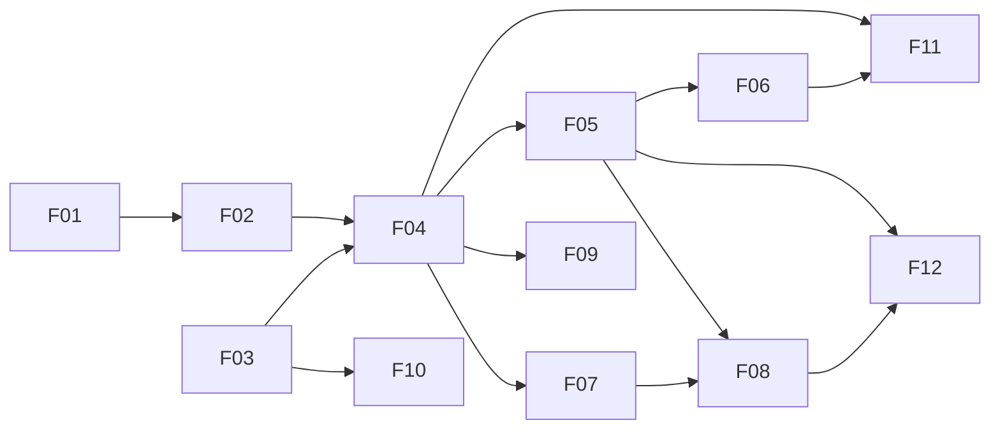

# Feature specs

The [design document](../monitoring%20server%20design.md) describes the whole system. These specs break it into sub-features that can be built, reviewed and tested separately. Infrastructure choices they rely on are recorded in the [ADRs](../adr/README.md).

Each spec follows the same shape: summary, scope per phase, behavior, data, API, acceptance criteria, open questions. All specs are **Draft** until reviewed.

## MVP features and build order

The order follows dependencies: nothing produces results until the plugin SDK and runner exist, and nothing alerts until state and notifications exist.

| # | Feature | Depends on | Status |
| --- | --- | --- | --- |
| [F01](F01-tenancy-auth-audit.md) | Tenancy, API keys, roles and audit log | — | Draft |
| [F02](F02-devices-credentials-templates.md) | Devices, credentials, templates and test connection | F01 | Draft |
| [F03](F03-plugin-sdk.md) | Plugin SDK and registry | — | Draft |
| [F04](F04-scheduler-and-runner.md) | Scheduler and runner | F02, F03 | Draft |
| [F05](F05-state-and-incidents.md) | State machine and incidents | F04 | Draft |
| [F06](F06-notifications.md) | Webhook notifications and alert routes | F05 | Draft |
| [F07](F07-metrics-store-and-retention.md) | Metrics store, rollups and retention | F04 | Draft |
| [F08](F08-push-ingestion.md) | Push ingestion: HTTP push, MQTT, last-seen | F05, F07 | Draft |
| [F09](F09-remote-probes.md) | Remote probes (enrollment and assignment in MVP, failover in phase 2) | F04 | Draft |
| [F10](F10-mvp-check-catalog.md) | MVP check and collector catalog | F03 | Draft |
| [F11](F11-self-monitoring.md) | Monitoring the monitor | F04, F06 | Draft |
| [F12](F12-fixlean-collector-replacement.md) | Replacing the FixLean sensor collector: embedded MQTT broker, sensor model, migration | F05, F07, F08 | Draft |

## Suggested milestones

| Milestone | Contents | Demo |
| --- | --- | --- |
| M1 — skeleton | Repo layout, CI, migrations, F01, F03, HTTP and ping plugins | Create a tenant and key; `GET /v1/plugins` lists two plugins |
| M2 — first loop | F02, F04, F05, F06 (single node) | Add a device with a ping and HTTP check; stop the target; a signed `incident.opened` webhook arrives in n8n |
| M3 — metrics | F07, Grafana data source and first dashboards | Interface and latency graphs in Grafana; retention changed via API drops partitions |
| M4 — targets | F10: SNMP, Redfish/IPMI, RTSP, XCP-ng, UPS/PDU | Our datacenter's switches, servers, cameras and XCP-ng pool are monitored |
| M5 — push and probes | F08, F09 (basic), F11 | MQTT sensors report; one remote site runs a probe; the dead man's switch fires when the core stops |
| M6 — FixLean shadow | F12 steps 0–2 | Engine in shadow mode against the current collector's broker produces the same threshold events |
| Gate 1 | Load test at 10,000 simulated devices ([ADR-0003](../adr/0003-metrics-storage-layout.md)), security review | Live on our own datacenter |

## Phase 2 and later

Specs will be written when phase 2 starts: dependency suppression and maintenance windows beyond the MVP basics, SNMP traps and syslog, templates and discovery (subnet, ONVIF, LLDP/CDP topology), VMware and Proxmox collectors, escalation schedules and on-call, BMC event logs and inventory change events, TimescaleDB acceleration, exec plugins, probe failover groups.
