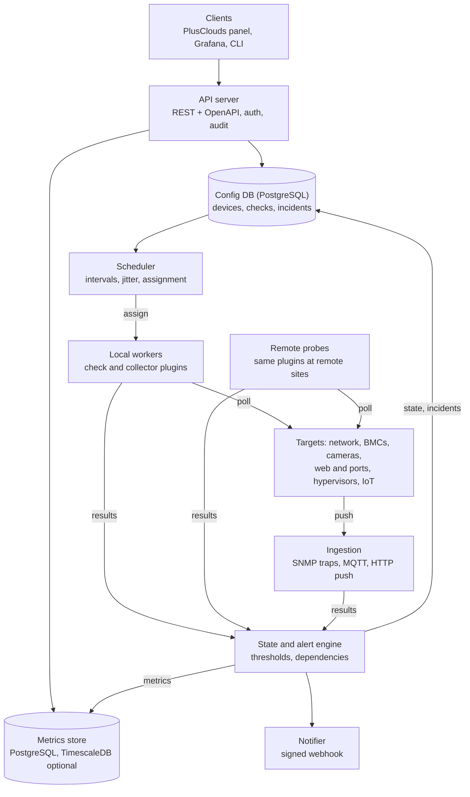
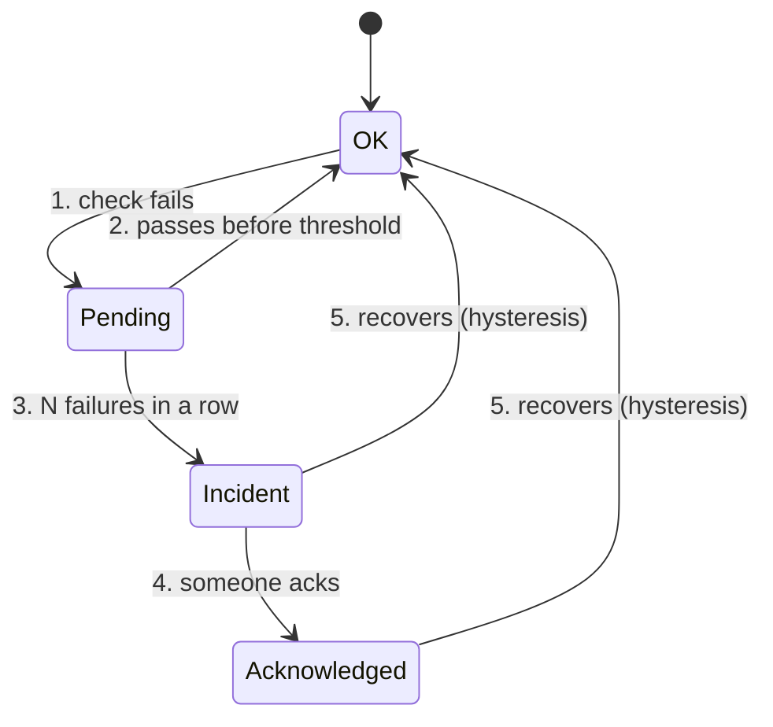

# Monitoring Engine — Design Documentation

**Status:** Planning · **Last updated:** 2026-09-28 · **Owner:** Harun Barış Bulut (PlusClouds)
**License:** MIT · **Repository:** PlusClouds GitHub

---

## Contents

1. [Overview](#1-overview)
2. [Decisions](#2-decisions)
3. [Monitoring targets](#3-monitoring-targets)
4. [Architecture](#4-architecture)
5. [Data model](#5-data-model)
6. [Alerting and notifications](#6-alerting-and-notifications)
7. [API design](#7-api-design)
8. [Security](#8-security)
9. [Operational requirements](#9-operational-requirements)
10. [Roadmap](#10-roadmap)
11. [Open questions](#11-open-questions)
12. [Sources](#12-sources)

---

## 1. Overview

A simple, extensible monitoring **engine** written in Go and managed entirely through an API. It monitors network devices, server hardware (BMCs), IP cameras, web endpoints and ports, hypervisors and their VMs, and IoT/facility devices from one place.

The engine is open source (MIT) and developed in the PlusClouds GitHub. It runs standalone or embedded in the PlusClouds panel, and customers use it too, so multi-tenancy is part of the core from the start. Dashboards come from Grafana, which existing customers already use; there is no built-in UI in this phase.

**Design target:** 10,000+ devices, with check intervals from 5 seconds to several hours depending on the device.

### Design principles

- **API-first.** Every action (add a device, define a check, silence an alert) is an API call. Any UI or CLI is a client of the same API.
- **Extensible by plugins.** New protocols and device types are added as plugins or templates, never as changes to the core.
- **Simple to run.** A single Go binary for the core, lightweight probes for remote sites, standard storage underneath.
- **Quiet by default.** Alerts point to root causes; noise is treated as a bug.
- **Open-source first.** Reuse proven libraries and standard formats (OpenAPI, PostgreSQL) instead of inventing new ones. No dependency may force a restrictive license on users.

### Scope

- **In scope:** availability checks, performance metrics, hardware health, alerting, notification events, and LLM monitoring: inference endpoints and GPUs, plus tracing, cost and quality evaluation of LLM calls ([F14](features/F14-llm-monitoring.md)).
- **Out of scope for now:** built-in UI, log management, general APM/tracing (only LLM calls and the steps around them are traced), full CMDB features, Hyper-V.

---

## 2. Decisions

| Topic | Decision |
| --- | --- |
| Audience and license | Open source under MIT, in our GitHub; used by PlusClouds, embedded in the PlusClouds panel, and run standalone by customers |
| Metrics storage | Plain PostgreSQL (partitioned tables) by default; TimescaleDB used automatically when present; ClickHouse as a later scale-out backend. No backend requires a restrictive license |
| UI | Engine and API first; Grafana for dashboards |
| Scale target | 10,000+ devices; ~6,700 metric rows/s baseline (20 metrics per device every 30 s), designed to grow beyond it |
| Check intervals | 5 seconds to hours, set per device and check |
| Retention | Set through the API per metric class and rollup level; no hardcoded defaults |
| Notifications | One signed webhook channel feeding n8n, Node-RED or the PlusClouds notification service |
| Probe packaging | Static binary and container image |
| Hypervisors | XenServer/XCP-ng first, then VMware, then Proxmox |
| Hyper-V | Not in this phase; revisit later |
| IoT | MQTT first (in use today); other protocols as requests arrive. The engine embeds its own MQTT broker and replaces `fixleanplus.metric.collector` (see [ADR-0013](adr/0013-embedded-mqtt-broker.md), [F12](features/F12-fixlean-collector-replacement.md)) |
| LLMs | In scope: inference endpoints and GPUs (phase 2), tracing, cost and quality evaluation of LLM calls (phase 2 and 3); general APM stays out ([F14](features/F14-llm-monitoring.md)) |
| Device model | A containment tree (`parent_id`), a separate dependency graph for suppression, sites as a table; parts of devices are objects, not devices; the entity is called device, not asset ([ADR-0014](adr/0014-device-model-containment-dependencies-sites.md)) |
| Source of truth | Each engine is the source of truth for what it monitors; PlusClouds links by external ID. All items are stored in PostgreSQL; per tenant, the source is the API or a declarative file ([ADR-0015](adr/0015-tenant-configuration-source.md)) |
| Process configuration | One YAML file per process (`deploy/config.example.yaml`, `deploy/probe.example.yaml`) with `MONITOR_A__B` overrides; tenant data never in it ([ADR-0011](adr/0011-toolchain-and-repository-layout.md)) |
| Event envelope | CloudEvents 1.0 with Standard Webhooks signing, the same as PlusClouds' own events; PlusClouds re-fires them into its listeners and pushers ([ADR-0009](adr/0009-webhook-delivery.md)) |
| Billing | Per check on each device in check-hours, priced by billing class, plus discovered devices (VMs) as a second unit; the engine meters, PlusClouds prices ([F13](features/F13-usage-metering.md)) |
| Probes | Outbound-only to the core; one-time or preshared enrollment tokens; a local HTTPS status server with a status token ([F09](features/F09-remote-probes.md)) |

---

## 3. Monitoring targets

| Target | Protocols | What we collect |
| --- | --- | --- |
| Network devices (switches, routers, firewalls) | SNMP v2c/v3 (polling + traps), ICMP; later NetFlow/sFlow/IPFIX | CPU, memory, uptime; per-interface status, bandwidth, errors, discards, speed/duplex |
| Server hardware (iDRAC, iLO, Supermicro, …) | Redfish (preferred), IPMI (fallback), SNMP | Temperatures, fans, PSUs and power draw, disks and RAID/virtual disks, DIMMs, CPUs, controller battery, event log (SEL) |
| IP cameras | ICMP, RTSP, ONVIF, HTTP snapshot | Reachability; stream codec, resolution, FPS, bitrate, RTP loss/jitter; device info and firmware; snapshot grab |
| Web pages, ports, services | HTTP/HTTPS, TCP, UDP, DNS, TLS, WHOIS | Status code, keyword match, timing breakdown (DNS, connect, TLS, first byte); port reachability; DNS answers; certificate and domain expiry |
| Hypervisors and VMs | XenServer/XCP-ng (XAPI + `rrd_updates`), VMware (vCenter API), Proxmox (REST API) | Host CPU, memory, NICs, storage repositories, pool/HA state; per-VM state, CPU usage and ready/steal time, memory/balloon/swap, per-disk IOPS and latency, per-NIC traffic and errors, snapshots, guest tools |
| IoT and facility devices | MQTT, SNMP (UPS-MIB, PDUs), HTTP push; later Modbus TCP/RTU (SunSpec), BACnet, LoRaWAN | UPS battery/runtime/load, PDU outlet current, temperature/humidity/leak/door sensors, cooling alarms, energy meters; device battery, signal strength, last-seen |
| LLM endpoints and applications | Synthetic inference requests (OpenAI-compatible APIs), Prometheus scraping (vLLM, TGI, NVIDIA DCGM), OpenTelemetry traces with GenAI conventions | Availability, time to first token, tokens/s, queue and KV-cache load, GPU health; per application requests, errors, tokens, cost; quality scores from evaluators and golden datasets |

### Key points from research

- **Prefer Redfish over IPMI.** It is the DMTF successor to IPMI, supported by Dell, HPE, Lenovo, Cisco, Supermicro and others, and it exposes vendor thresholds.
- **Ping is not enough for cameras.** A camera can answer ping while its stream is broken or frozen; check bitrate, FPS and resolution.
- **Collect VM metrics from the hypervisor.** A VM can look healthy inside the guest while waiting for CPU or suffering storage latency on the host.
- **Many IoT devices push.** For them, silence is the failure, so every push device needs a last-seen check.
- **For XCP-ng, poll `rrd_updates` per host,** not per VM: one call returns everything changed since a timestamp.

### Hypervisor and VM metrics in detail

**Host level:** management API reachability, pool master and HA state, physical CPU (per core and average), memory total/free and overcommit ratio, physical NIC throughput/errors/drops/link state, storage repository capacity, fill rate and latency, running VM count, maintenance mode. Link each host to its BMC device so they appear as one physical server.

**VM level:** power state and uptime (to detect unexpected reboots), CPU usage from the host view, CPU ready/steal time (sustained >5% indicates contention), memory configured/target/actual, ballooning and swap, per-disk IOPS/throughput/latency, per-NIC rx/tx/errors/drops, guest tools status, snapshot count and age, disk chain health.

---

## 4. Architecture

The core is one Go service with separable roles. Polled checks, hypervisor collectors and pushed data all feed the same state and alert engine.



Remote probes pull their assigned checks from the API and push results back, so private networks need no inbound access.

### Plugin types

- **Checks** test one thing and return a status plus optional metrics (ping, HTTP, SNMP get, Redfish health, RTSP).
- **Collectors** make one connection and return many metrics plus inventory (XCP-ng pool, vCenter, Proxmox cluster, SNMP interface table). Discovered objects such as VMs become child devices.
- **Ingesters** receive pushed data (SNMP traps, syslog, MQTT, HTTP push) and map it to devices and metrics.

Illustrative Go interfaces:

```go
type Check interface {
    Type() string
    Validate(cfg json.RawMessage) error
    Run(ctx context.Context, target Target) (Result, error)
}

type Collector interface {
    Type() string
    Validate(cfg json.RawMessage) error
    Collect(ctx context.Context, target Target) (Batch, Inventory, error)
}

type Ingester interface {
    Type() string
    Start(ctx context.Context, sink ResultSink) error
}
```

### Deployment

A single binary runs all roles for small setups; roles can be split and scaled out later. Probes are the same binary in probe mode, shipped both as a static binary and as a container image.

### Storage

PostgreSQL holds configuration, state and incidents. Metrics go through a storage interface with three backends, so no user is ever forced into a restrictive license:

1. **Default: plain PostgreSQL** with time-partitioned tables. The engine creates and drops partitions and computes 5-minute and 1-hour rollups itself, so retention per metric class stays fully under API control. It runs on any PostgreSQL, including managed services.
2. **Optional acceleration: TimescaleDB.** If the Community Edition is present, the engine uses hypertables, compression and continuous aggregates; otherwise it falls back to option 1. These features are under the Timescale License, which is free to use but prohibits offering TimescaleDB itself as a hosted database service, and some managed PostgreSQL providers only ship the Apache edition without them.
3. **Scale-out later: ClickHouse** (Apache 2.0), whose per-table TTL and materialized views map well to API-driven retention and rollups.

Grafana reads PostgreSQL and TimescaleDB directly through its PostgreSQL data source.

### Scale

10,000+ devices with intervals as short as 5 seconds means thousands of check executions and metric rows per second. This drives three design choices:

- a sharded scheduler with jitter, so checks don't fire in bursts;
- batched metric writes (`COPY` in batches rather than row-by-row inserts);
- horizontal scaling of workers and probes.

### Candidate Go libraries (to verify)

| Area | Library |
| --- | --- |
| SNMP | `gosnmp` |
| Redfish | `gofish` |
| ICMP | `pro-bing` |
| DNS | `miekg/dns` |
| RTSP | `gortsplib` |
| VMware | `govmomi` |
| XenServer/XCP-ng | XenServer Go SDK or raw XAPI calls |
| Proxmox | a Proxmox API client |
| MQTT | Eclipse Paho |
| PostgreSQL | `pgx` |

---

## 5. Data model

Devices form a containment tree through `parent_id` (pool → host → VM). Which device needs which other device to work is a separate dependency graph, and it drives alert suppression. Parts of a device reported by collectors (interfaces, fans, disks, GPUs) are objects, not devices. See [ADR-0014](adr/0014-device-model-containment-dependencies-sites.md).

| Entity | Key fields | Relations |
| --- | --- | --- |
| Tenant | name, limits, status, external ID (PlusClouds `iam_accounts` UUID) | owns everything below; mirrors a PlusClouds account |
| User | external ID (PlusClouds `iam_users` UUID), optional display name, status; no personal data | member of tenants with a role; acts through the PlusClouds platform key |
| Site | name, country (ISO 3166-1), timezone, external ID | holds probes and devices |
| Device | name, address, type, tags, `parent_id`, `site_id`, `probe_id`, inventory (vendor, model, serial, firmware), external ID | containing device (pool, host); discovered children (VMs); objects inside its collectors (interfaces, fans, disks) |
| Device dependency | device, depends-on device, source (user, collector, LLDP) | directed graph without cycles; used for suppression |
| Credential | type (SNMPv2c, SNMPv3, Redfish, IPMI, XAPI, MQTT, …), encrypted secret | referenced by devices and checks; never returned by the API |
| Template | name, target model, check/collector definitions, runbook link | applied to devices to create checks |
| Check | plugin type, config (JSON), interval, timeout, thresholds, failure count, enabled | belongs to a device; produces results and state |
| Collector | plugin type, config, interval | belongs to a device (e.g. hypervisor pool); creates child devices and metrics |
| Probe | name, `site_id`, version, last seen | runs assigned checks; failover group |
| State | status (OK/WARNING/CRITICAL/UNKNOWN), since, last result, output | one per check |
| Incident | severity, opened/acked/resolved times, root device, suppressed children | opened by state changes; links to notifications |
| Alert rule and route | conditions, severity, labels, escalation steps, schedule | selects which incidents go to which webhook events |
| Maintenance window | scope (devices, tags), start, end, reason | suppresses notifications; always has an end time |
| Retention policy | metric class, rollup level, duration | set via API; applied by the metrics store |
| Audit event | actor, action, object, before/after, time | written for every API change |

Accounts and users are owned by PlusClouds; the engine keeps only a minimal mirror keyed by PlusClouds UUIDs. Devices, credentials, templates, probes, webhook endpoints, alert routes and maintenance windows carry optional `external_source`, `external_type` and `external_id` fields, unique per tenant, so PlusClouds can upsert and look them up by its own IDs (see [ADR-0012](adr/0012-plusclouds-identity-and-external-ids.md)).

Metrics live in the metrics store, keyed by labels (tenant, device, check, interface, VM UUID). VMs are keyed by UUID so live migration only re-parents them.

---

## 6. Alerting and notifications

Every check runs through one state machine, with noise control built in.



1. A check fails once and moves to **Pending**; nothing is sent yet.
2. It passes again before the threshold; the blip is logged, not alerted.
3. It fails N times in a row (or a metric stays past its threshold for a set duration); an **incident** opens.
4. Someone acknowledges; escalation stops but the incident stays open.
5. It recovers past the hysteresis margin; the incident resolves and a recovery event goes out.

### Noise controls

- **Dependency suppression.** If a parent (switch, host, UPS) is down, children's incidents are marked suppressed and grouped under the root cause.
- **Maintenance windows.** Scheduled via API, always with an end time; checks keep running so data has no gaps.
- **Grouping and repeat interval.** Related incidents are sent as one event; open incidents re-notify on a slow schedule.
- **Flap detection.** Checks that change state too often in a window are marked flapping and notify once.
- **Hysteresis.** Alert at 90%, resolve only below 85%, so values hovering at a threshold don't toggle.

### Notifications

Notifications go out through **one channel: a signed webhook.** The engine emits incident events (opened, acknowledged, escalated, resolved) as JSON; n8n, Node-RED or the PlusClouds notification service turns them into email, Slack, SMS or anything else. The engine records delivery status and retries failed deliveries.

Escalation state stays in the engine: routes match incidents by severity, tags and tenant, and each route has steps (notify now, escalate after N minutes unacknowledged). Each step is another webhook event with a different recipient or severity.

Events use the same CloudEvents 1.0 envelope and Standard Webhooks signing as PlusClouds' own event pushers ([ADR-0009](adr/0009-webhook-delivery.md)). PlusClouds receives them on one endpoint and re-fires them into its existing listeners, so email, SMS, panel inbox, chat and live panel updates come from PlusClouds' notification system ([ADR-0012](adr/0012-plusclouds-identity-and-external-ids.md#plusclouds-receiver)).

---

## 7. API design

REST over JSON under `/v1`, described by an OpenAPI spec that is the source of truth for clients and docs.

### Principles

- **Resource-oriented and versioned.** Breaking changes only in a new version.
- **Idempotent writes.** `PUT` by external ID and an `Idempotency-Key` header, so scripts and Terraform can re-run safely.
- **Bulk and declarative.** Bulk create/update endpoints and an `apply` endpoint that takes a full YAML/JSON config and returns a diff first (dry run).
- **Consistent listing.** Cursor pagination, filtering by tags and labels, field selection.
- **Scoped API keys.** Per tenant, with roles (read-only, operator, admin); every write goes to the audit log.
- **Event stream.** Webhooks plus a streaming endpoint (SSE) for state changes, so the PlusClouds panel can update live.

### Resources

| Resource | Main operations |
| --- | --- |
| `/devices` | CRUD, bulk, `test` (run all checks once), `children`, `inventory` |
| `/checks`, `/collectors` | CRUD, `run-now`, `results`, enable/disable |
| `/templates` | CRUD, `apply` to devices |
| `/credentials` | create, update, delete, `test`; secrets are write-only |
| `/probes` | register, list, assignments, health |
| `/incidents` | list, get, `ack`, `resolve`, `comment` |
| `/alert-routes`, `/webhooks`, `/schedules` | CRUD, `test` for webhooks |
| `/maintenance` | CRUD |
| `/retention-policies` | CRUD per metric class and rollup level |
| `/metrics` | query and aggregate from the metrics store |
| `/ingest/{device}`, `/ingest/mqtt-mappings` | push endpoint, payload mapping config |
| `/discovery` | start subnet/ONVIF/LLDP scans, review and accept results |
| `/audit` | list and filter events |
| `/config/apply`, `/config/export` | declarative import (with dry run), full export |

---

## 8. Security

A monitoring system holds credentials for nearly every device, so it is a high-value target.

- **Credentials.** Encrypted at rest (envelope encryption, key outside the DB), write-only through the API, decrypted only in the worker that uses them. Plan for rotation.
- **Least privilege on devices.** Read-only SNMP views, read-only BMC and hypervisor accounts; never reuse admin credentials.
- **SNMPv3 authPriv by default.** Allow v2c only per device, with source-IP ACLs on the device side.
- **Probe trust.** Probes enroll with a one-time token, then use mutual TLS; they only make outbound connections to the core.
- **Ingestion isolation.** Push endpoints (HTTP, MQTT) run separately from the management API, with per-device credentials that can be revoked individually.
- **API security.** Scoped keys, rate limits, audit log for every write, TLS everywhere.
- **Signed webhooks.** Every outgoing event is signed so receivers can verify it.
- **SSRF guard.** HTTP checks can target internal addresses; restrict targets per tenant.
- **Tenant isolation.** Enforced in every query, including metric labels.
- **Device firmware.** Polling can trigger device bugs (e.g. CVE-2025-20352 in the SNMP subsystem of some Cisco IOS/IOS XE devices); keep firmware current.

Certifications, regulations and the ISO/IEC 27001 control mapping are covered in [Standards and compliance](compliance/README.md).

---

## 9. Operational requirements

Topics mature monitoring systems handle beyond the device list:

| Topic | Why it matters | What we build |
| --- | --- | --- |
| Monitoring the monitor | If the engine dies, nothing alerts | Dead man's switch heartbeat to an external endpoint; self-metrics (queue depth, check lag, probe status) |
| Poller self-protection | Aggressive SNMP polling can spike a switch's CPU; one slow device can stall workers and drift the schedule, causing false "down" alerts | Per-device concurrency limits; fast polls separate from slow table walks; GETBULK; longer SNMPv3 timeouts; poll-cycle duration as a first-class metric |
| Counter handling | Counters wrap and reset on reboot, producing false spikes | 64-bit HC counters; detect resets via `sysUpTime`; discard negative deltas |
| Topology discovery | LLDP/CDP neighbor tables show which device is on which port | Build and refresh the dependency tree automatically |
| Retention and downsampling | Raw data forever is expensive and slow | Raw → 5-min → 1-hour rollups (min, max, sum, count), retention per class via API |
| High availability | A single core instance is a single point of failure | Stateless API/scheduler nodes on shared storage; probes reassign checks when a probe goes silent |
| Inventory and change events | Serials, models and firmware are already returned by Redfish/SNMP/ONVIF | Inventory per device; events for reboot, firmware change, new/removed interface or VM, new device |
| Escalation and on-call | Unacknowledged critical alerts need to reach someone else | Ack, escalation after N minutes, schedules, delivery status |
| Multi-tenancy and RBAC | Customers use the engine | Tenants, roles, scoped keys from day one |
| Audit log | Who silenced what matters during incidents | Immutable log of every API write |
| Config as code | Hundreds of devices are easier to manage as files | Idempotent bulk API, YAML/JSON import/export, later a Terraform provider |
| Test connection | Most onboarding failures are credentials or blocked ports | `POST /devices/{id}/test` runs every check once and returns raw results |
| Runbooks and annotations | Responders need context | Runbook link per check/template; notes on incidents and graphs |
| Reporting | Customers ask for availability numbers | SLA/uptime reports per device, group and tenant |
| Operational basics | Easy to forget | UTC timestamps, NTP on probes, IPv6/dual-stack, source-interface selection, config backup/restore, load tests at the scale target |

---

## 10. Roadmap

The MVP covers every requested target type at a basic level, so the full loop (check → state → incident → notification) is proven before scaling out.

| MVP — core loop end to end | Phase 2 — scale and noise control | Phase 3 — customer-facing, advanced |
| --- | --- | --- |
| Ping, TCP/UDP, HTTP, TLS, DNS | Remote probes, failover | NetFlow/sFlow, config backup |
| SNMP polling, interface stats | Dependencies, maintenance | BACnet, LoRaWAN |
| Redfish and IPMI health | SNMP traps and syslog | PlusClouds panel integration |
| RTSP camera stream check | Templates and discovery | Status pages, SLA reports |
| XenServer/XCP-ng collector | LLDP/CDP topology | Noisy-neighbor correlation |
| UPS, PDU, sensors via SNMP | VMware, then Proxmox | Pre/post-migration comparison |
| MQTT, HTTP push, last-seen | Modbus and other IoT | Anomaly and baseline alerts |
| State machine, incidents | Escalation and on-call | Terraform provider |
| Signed webhook notifications | BMC event logs, inventory | Grafana dashboard pack |
| Tenants, scoped keys, audit | TimescaleDB acceleration | Hyper-V collector |
| PostgreSQL metrics, retention via API | LLM endpoints, Prometheus scraping, LLM trace metrics | ClickHouse backend |
| | | LLM content capture and quality evaluation |
| **Gate 1:** live on our own datacenter | **Gate 2:** stable on remote sites | **Then:** offer to customers |

Gates are proposals; dates are not set yet.

---

## 11. Open questions

- [x] **MQTT specifics:** taken from `fixleanplus.metric.collector`, which the engine replaces. See [F12](features/F12-fixlean-collector-replacement.md) for the topic and payload profile and the remaining migration questions.
- [x] **Webhook event schema and signing:** CloudEvents 1.0 envelope and Standard Webhooks signing, shared with PlusClouds ([ADR-0009](adr/0009-webhook-delivery.md)).
- [ ] **Resellers:** sub-tenants for a cloud provider's own customers ([F01](features/F01-tenancy-auth-audit.md)). Does PlusClouds already model resellers in `iam_accounts`? Decide before phase 3.
- [ ] **IPMI monitoring in leo4:** `plusclouds.api.v4` already collects IPMI metrics and raises compute member alarms (`SaveIpmiMetricsJob`, `ComputeMemberAlarm`). Inventory what it covers and plan its replacement by the engine, as for FixLean ([F12](features/F12-fixlean-collector-replacement.md)).
- [ ] **Billing classes and LLM units:** confirm with PlusClouds pricing ([F13](features/F13-usage-metering.md)).
- [ ] **Datacenter vendors:** which switch, BMC, UPS and PDU vendors we run decides the first vendor profiles ([F10](features/F10-mvp-check-catalog.md)).
- [ ] **LLM infrastructure at PlusClouds:** which endpoints and GPUs run today, hosted judge model or not, expected trace volume ([F14](features/F14-llm-monitoring.md)).

---

## 12. Sources

- [Who monitors the monitoring system? (HelloFresh Engineering)](https://engineering.hellofresh.com/who-monitors-the-monitoring-system-is-my-prometheus-alive-at-all-2789fd3647b3)
- [SNMP poll response latency: diagnosing a slow poller (Netdata)](https://www.netdata.cloud/guides/network/network-snmp-poll-latency/)
- [Network device topology map (Datadog docs)](https://docs.datadoghq.com/network_monitoring/devices/network_topology_map)
- [Retention and downsampling (Exoscale Thanos docs)](https://community.exoscale.com/product/dbaas/service-specific/thanos/how-to/retention-downsampling/)
- [XCP-ng monitoring and alerts (XCP-ng docs)](https://docs.xcp-ng.org/management/monitoring/)
- [IPMI and Redfish monitoring (ManageEngine OpManager)](https://www.manageengine.com/network-monitoring/help/ipmi-monitoring.html)
- [RTSP video stream monitoring (10-Strike)](https://10-strike.com/network-monitor/help/monitoring/rtsp-videostream-monitoring.shtml)
- [VMware monitoring metrics (ManageEngine)](https://www.manageengine.com/network-monitoring/tech-topics/how-to-monitor-vmware-server.html)
- [Libvirt input plugin metrics (Telegraf)](https://pkg.go.dev/github.com/influxdata/telegraf/plugins/inputs/libvirt)
- [Alerting best practices (Grafana docs)](https://grafana.com/docs/grafana/v12.4/alerting/best-practices/)
- [Timescale licenses (Tiger Data)](https://www.tigerdata.com/legal/licenses)
- [Compare TimescaleDB editions (Tiger Data docs)](https://www.tigerdata.com/docs/about/latest/timescaledb-editions)